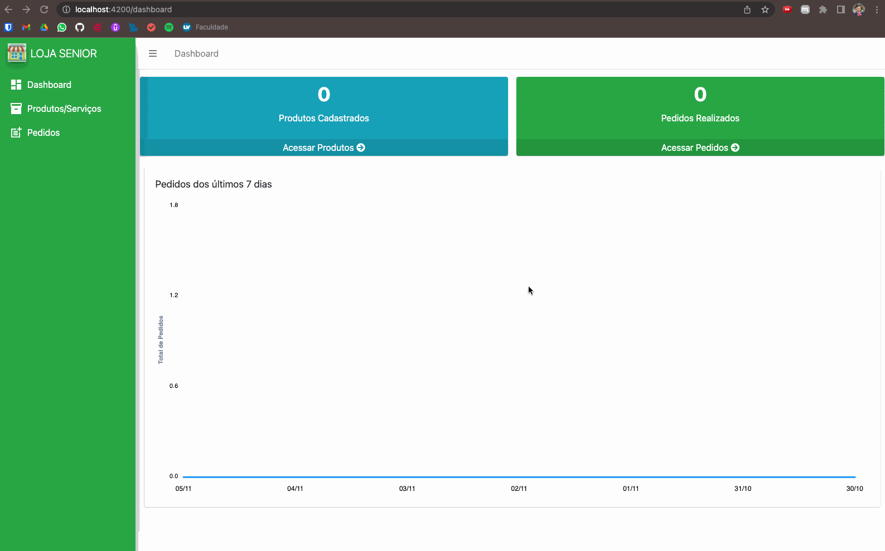
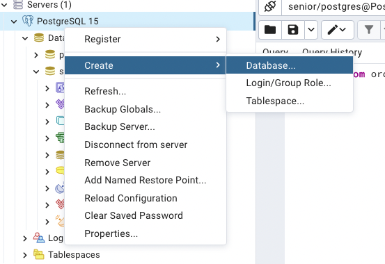
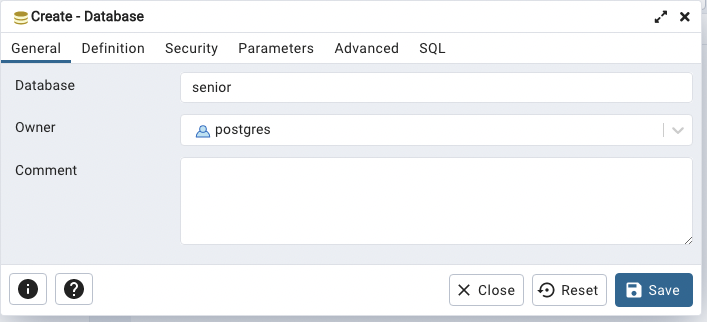

## **Test Senior Backend**

## **🗃️ Table of Contents**

- [About the project]()
- [Back-end diagrams]()
- [Application flowchart]()
- [Application in operation]()
- [Instructions for execute the Project]()
- [Technologies and Concepts]()
- [Author]()

---

## **Challenge**

Minimum technologies that must be used:
- PostgreSQL database
- Java 8+
- JPA
- REST with JSON

Test requirements:
 - A register must be developed (Create/Read/Update/Delete/List) for the following entities: product/service, order, and order items.
 - All entities must have a unique ID of type UUID
 - In the product/service registration, there must be an indication to differentiate a product from a service.
 - It must be possible to apply a percentage discount on the order, but only for the items that are product (not service); the discount will be on the total value of the products.

Acceptance criteria:
 - The test must be delivered in full (all items solved)
 - The code cannot have compilation errors.
 - There must be minimal documentation of how to execute the project and its functionalities.


---
<br>

## 📈 **Application Structure Back-end**


> Back-end Class Diagram


> Back-end Application Structure

## 📈 **Application Structure Front-end**

<br>

## 🔀&nbsp; **Application flowchart**

The system flow is based on the concept:


</br>

----

## ▶️  **Application in operation**




----
<br>

## **🔀 Application Sections**
---
## 📦&nbsp; Product / Service

In the products and services section are related the ProductService class where are the attributes and encapsulation for handling products and services, the Controller ProductServiceController class containing the CRUD manipulation methods and the IProductServiceRepository interface inheriting the JpaRepository.
For the classification of the type of registered item (Product/Service) and the unit of measure of the item, two Enuns were created to be used.
The identification key generated for each item was of type UUID.
The controller still uses the MaturityLevel3 Class that inherits from ItemLevel3 to structure a maturity level 3 API.

<br>

## 🧾&nbsp; Order

In the order section are related the Order class where are the attributes and encapsulation for order manipulation, the OderController class containing the CRUD manipulation methods and the IOrderRepository interface inheriting the JpaRepository.
The identification key generated for each item was of type UUID.
The controller still uses the MaturityLevel3 Class that inherits from ItemLevel3 to structure a maturity level 3 API.

<br>

## 🧾&nbsp; OrderItens

In the order items section, the OrderItens class is listed, where are the attributes and encapsulation for handling the products and services of the order, the OderItensController class containing the CRUD manipulation methods and the IOrderRepository interface inheriting the JpaRepository.
The identification key generated for each item was of type UUID.
The controller still uses the MaturityLevel3 Class that inherits from ItemLevel3 to structure a maturity level 3 API.

<br>

---

## **👨🏽‍🏫 Instructions for execute the Project**
    
## **Spring**

1. To run the project, Java JDK, Spring tools Suite and Maven must be installed and the environment variable defined.
2. To install Java JDK
    - Download JDK from [here](https://drive.google.com/file/d/1fT_WYUkoMXVoRfWb6EgSr8Hn9BevUeLO/view?usp=sharing)
    - Install the JDK exe File
    - Check the Directory ``C:\Program Files\Java\jdk-xxx`` if exists folder jdk
3. To install Maven
    - Download Maven [here](https://maven.apache.org/download.cgi)
    - Unzip file
    - Create a folder named maven in ``C:\``
    - Press the Windows key on the keyboard and type: "edit system variables". Click on the option that appears.
    - On the "Environment Variables" screen that will open, click the "New" button just below the part of the screen that says "environment Variables".
    - In the variable name and value fields, fill in: ``MAVEN_HOME`` and ``C:\maven\bin``, respectively. Confirm.
    - Check if it worked by opening a new prompt and typing ``mvn -version``
4. To install Spring Tools Suite
    - Download Spring Tools Suite from the [site](https://spring.io/tools)
    - Double click on the downloaded file to unzip.
    - Wait for unpacking.
    - A folder called ``sts-x.xx.x.RELEASE`` will be created in the unzip location.
    - Move the folder to a location of your choice.
    -Select the ``SpringToolSuite4`` application from inside the folder and create a shortcut on the desktop for easy access.
5. Make a project copy to your machine:
    - git clone [https://github.com/seiler-emerson/senior_test_backend](https://github.com/seiler-emerson/senior_test_backend.git)
    - Or a direct download from the page [HERE](https://github.com/seiler-emerson/senior_test_backend.git).
6. Import the project into your Spring Tools Suite.
    - File -> Import -> Maven -> Existing Maven Projects -> Next -> Browse -> Select Downloaded Project -> Finish
7. A change to the application.properties file is required.
    - It is necessary to define your bank address, username and password.
    - By default these are the data, just when installing the database enter the same data for username and password (
user: postgres and password: senior123 )
    ```` 
    spring.datasource.url=jdbc:postgresql://localhost:5432/senior
    spring.datasource.username=postgres
    pring.datasource.password=senior123
    ````

## **PostgreeSql**

1. To run the project, PostgreeSql just needs to be running with a database called senior.
2. Download the installer from this [link](https://www.postgresql.org/download/) which takes you to the postgree website.
3. After downloading, double click on the installation file.
4. The welcome screen will open, click the NEXT> button to start the installation.
5. You will be presented with the option to change the location where PostgreSQL will be installed, the default is in the program files folder, click the NEXT> button to continue.
6. The next screen will show where the bank will be saved.
7. The next screen will be for creating the bank password, the project was configured with the password "senior123".
8. In this screen we can leave as the default that where the database cluster will be used, clusters are used to increase the performance of the database, click the NEXT> button to continue.
9. Setup is ready to install PostgreSQL, click NEXT> button to install.
10. When finished it will be a completion screen, just click finish.
11. Now in programs open the "pgAdmin" application.
12. In the left side menu click on PostgreSQL with the right button and navigate to create -> database and create a database with the name senior.
<br>




<br>

## **Angular**

1. Make a project copy to your machine:
    - git clone [https://github.com/seiler-emerson/senior_test_frontend](https://github.com/seiler-emerson/senior_test_frontend)
    - Or a direct download from the page [HERE](https://github.com/seiler-emerson/senior_test_frontend).
2. Import the project into your VSCode.
    - If you don't have VSCode installed, watch this video I recorded teaching you how to install it. [VIEW VIDEO](https://youtu.be/82GnguThEAQ).
3. The node must be installed.
    - If you don't have node installed, go to the page and download it according to your operating system.
    - Node download page [HERE](https://nodejs.org/en/).
4.  Angular CLI must be installed.
    - If the Angular CLI is not installed it will be necessary to install it, for that node must be installed. Run the following command in your terminal:
    
    `npm install -g @angular/cli@latest`
    
    - After performing the previous steps, it will be necessary to install the dependencies used in the project, with the project page open in the terminal, run:
    
    `npm install`
    
    - With everything ready, just run the ng serve command and open the link provided in the browser of your choice.
    
    `ng serve`
---

## **📚 Postman**

You can test the requests through Postman, importing the collections available [here](https://github.com/seiler-emerson/senior_test_backend/tree/main/collection_postman).

<br>

---

<br>

## **📚 Technologies and Concepts**

In this project we use Angular framework with HTML5, CSS3, Bootstrap and apply the following concepts:

1. Git
2. Java
3. Spring 
4. Maven
5. Jpa
6. Postgree

----

<br>

## 👨🏻‍🎓  **Author**

<br>

<table>
<thead>
	<tr>
		<th>
            <a href="https://seiler-emerson.github.io/">
                
            </a>
        </th>
	</tr>
</thead>
<tbody>
	<tr>
		<td>
            <a href="https://www.linkedin.com/in/seileremerson/">
                
            </a>
        </td>
	</tr>
</tbody>
</table>

<br>

---